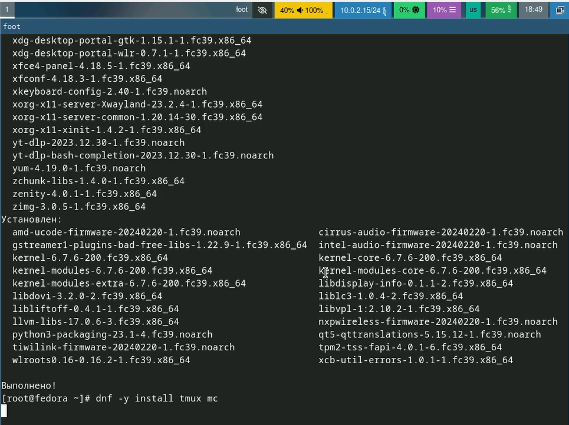

---
## Front matter
title: "Лабораторная работа №1"
subtitle: "Предварительная настройка оборудования"
author: "Солдатов Алексей"

## Generic otions
lang: ru-RU
toc-title: "Содержание"

## Bibliography
bibliography: bib/cite.bib
csl: pandoc/csl/gost-r-7-0-5-2008-numeric.csl

## Pdf output format
toc: true # Table of contents
toc-depth: 2
lof: true # List of figures
lot: true # List of tables
fontsize: 12pt
linestretch: 1.5
papersize: a4
documentclass: scrreprt
## I18n polyglossia
polyglossia-lang:
  name: russian
  options:
	- spelling=modern
	- babelshorthands=true
polyglossia-otherlangs:
  name: english
## I18n babel
babel-lang: russian
babel-otherlangs: english
## Fonts
mainfont: PT Serif
romanfont: PT Serif
sansfont: PT Sans
monofont: PT Mono
mainfontoptions: Ligatures=TeX
romanfontoptions: Ligatures=TeX
sansfontoptions: Ligatures=TeX,Scale=MatchLowercase
monofontoptions: Scale=MatchLowercase,Scale=0.9
## Biblatex
biblatex: true
biblio-style: "gost-numeric"
biblatexoptions:
  - parentracker=true
  - backend=biber
  - hyperref=auto
  - language=auto
  - autolang=other*
  - citestyle=gost-numeric
## Pandoc-crossref LaTeX customization
figureTitle: "Рис."
tableTitle: "Таблица"
listingTitle: "Листинг"
lofTitle: "Список иллюстраций"
lotTitle: "Список таблиц"
lolTitle: "Листинги"
## Misc options
indent: true
header-includes:
  - \usepackage{indentfirst}
  - \usepackage{float} # keep figures where there are in the text
  - \floatplacement{figure}{H} # keep figures where there are in the text
---

# Цель работы

Целью данной работы является приобретение практических навыков установки операционной системы на виртуальную машину, настройки минимально необходимых для дальнейшей работы сервисов.

# Задание

1. Создание виртуальной машины
2. Установка операционной системы
3. Обновление настроек
4. Настройка раскладки клавиатуры
5. Установка программного обеспечения

# Теоретическое введение

Здесь описываются теоретические аспекты, связанные с выполнением работы.

Например, в табл. [-@tbl:std-dir] приведено краткое описание стандартных каталогов Unix.

: Описание некоторых каталогов файловой системы GNU Linux {#tbl:std-dir}

| Имя каталога | Описание каталога                                                                                                          |
|--------------|----------------------------------------------------------------------------------------------------------------------------|
| `/`          | Корневая директория, содержащая всю файловую                                                                               |
| `/bin `      | Основные системные утилиты, необходимые как в однопользовательском режиме, так и при обычной работе всем пользователям     |
| `/etc`       | Общесистемные конфигурационные файлы и файлы конфигурации установленных программ                                           |
| `/home`      | Содержит домашние директории пользователей, которые, в свою очередь, содержат персональные настройки и данные пользователя |
| `/media`     | Точки монтирования для сменных носителей                                                                                   |
| `/root`      | Домашняя директория пользователя  `root`                                                                                   |
| `/tmp`       | Временные файлы                                                                                                            |
| `/usr`       | Вторичная иерархия для данных пользователя                                                                                 |

Более подробно про Unix см. в [@tanenbaum_book_modern-os_ru; @robbins_book_bash_en; @zarrelli_book_mastering-bash_en; @newham_book_learning-bash_en].

# Выполнение лабораторной работы

Создал новую виртуальную машину, дал ей название и выбрал необходимый образ ОС (рис. [-@fig:001]).

{#fig:001 width=70%}

Создал новую жесткий диск и выбрал необходимый размер (рис. [-@fig:002]).

{#fig:002 width=70%}

Указал необходимое количество основной памяти и ядер (рис. [-@fig:003]).

{#fig:003 width=70%}

В конечном счете получилась такая конфигурация (рис. [-@fig:004]).

{#fig:004 width=70%}

Запустил liveinst (рис. [-@fig:005]).

{#fig:005 width=70%}

Приступил к установке ОС (рис. [-@fig:006]).

{#fig:006 width=70%}

После установки оптический диск не был отключен, пришлось изъять его самостоятельно (рис. [-@fig:007]).

{#fig:007 width=70%}

Переключился на роль супер-пользователя и обновил все пакеты (рис. [-@fig:008]).

{#fig:008 width=70%}

Для удобства работы установил tmux и mc (рис. [-@fig:009]).

{#fig:009 width=70%}

Прописал команду для автоматического обновления (рис. [-@fig:010]).

{#fig:010 width=70%}

Запустил таймер (рис. [-@fig:011]).

{#fig:011 width=70%}

Заменил значение в файле /etc/selinux/config/etc/selinux/config (рис. [-@fig:012]).

{#fig:012 width=70%}

Перегрузил виртуальную машину (рис. [-@fig:013]).

{#fig:013 width=70%}

Переключитесь на роль супер-пользователя и установил средства разработки (рис. [-@fig:014]).

{#fig:014 width=70%}

Установил пакет DKMS (рис. [-@fig:015]).

{#fig:015 width=70%}

В меню виртуальной машины подключил образ диска дополнений гостевой ОС (рис. [-@fig:016]).

{#fig:016 width=70%}

Подмонтировал диск и установил драйвера, перезапустил систему (рис. [-@fig:017]).

{#fig:017 width=70%}

Вошел в ОС под заданной вами при установке учётной записью, запустил терминал, запустил терминальный мультиплексор tmux и создал конфигурационный файл (рис. [-@fig:018]).

{#fig:018 width=70%}

Отредактировал конфигурационный файл (рис. [-@fig:019]).

{#fig:019 width=70%}

Переключился на роль супер-пользователя, отредактировал конфигурационный файл "/etc/X11/xorg.conf.d/00-keyboard.conf" и перезагрузил виртуальную машину (рис. [-@fig:020]).

{#fig:020 width=70%}

Запустил терминальный мультиплексор tmux, переключился на роль супер-пользователя и установил pandoc (рис. [-@fig:021]).

{#fig:021 width=70%}

Установил дистрибутив TeXlive (рис. [-@fig:022]).

{#fig:022 width=70%}

Выполнил домашние задания (рис. [-@fig:023], [-@fig:024]).

{#fig:023 width=70%}

{#fig:024 width=70%}

# Выводы

Приобрел практические навыки установки операционной системы на виртуальную машину, настроил минимально необходимые для дальнейшей работы сервисы.

# Список литературы{.unnumbered}

::: {#refs}
:::
