---
## Front matter
lang: ru-RU
title: Лабораторная работа №2
subtitle: Github
author:
  - Солдатов А. Е.
institute:
  - Российский университет дружбы народов, Москва, Россия
  
## i18n babel
babel-lang: russian
babel-otherlangs: english

## Formatting pdf
toc: false
toc-title: Содержание
slide_level: 2
aspectratio: 169
section-titles: true
theme: metropolis
header-includes:
 - \metroset{progressbar=frametitle,sectionpage=progressbar,numbering=fraction}
 - '\makeatletter'
 - '\beamer@ignorenonframefalse'
 - '\makeatother'
---

## Цель работы

- Изучить идеологию и применение средств контроля версий.
- Освоить умения по работе с git.

## Задание

1. Создать базовую конфигурацию для работы с git.
2. Создать ключ SSH.
3. Создать ключ PGP.
4. Настроить подписи git.
5. Зарегистрироваться на Github.
6. Создать локальный каталог для выполнения заданий по предмету.

# Теоретическое введение

Здесь описываются теоретические аспекты, связанные с выполнением работы.

Например, в табл. [-@tbl:std-dir] приведено краткое описание стандартных каталогов Unix.

: Описание некоторых каталогов файловой системы GNU Linux {#tbl:std-dir}

| Имя каталога | Описание каталога                                                                                                          |
|--------------|----------------------------------------------------------------------------------------------------------------------------|
| `/`          | Корневая директория, содержащая всю файловую                                                                               |
| `/bin `      | Основные системные утилиты, необходимые как в однопользовательском режиме, так и при обычной работе всем пользователям     |
| `/etc`       | Общесистемные конфигурационные файлы и файлы конфигурации установленных программ                                           |
| `/home`      | Содержит домашние директории пользователей, которые, в свою очередь, содержат персональные настройки и данные пользователя |
| `/media`     | Точки монтирования для сменных носителей                                                                                   |
| `/root`      | Домашняя директория пользователя  `root`                                                                                   |
| `/tmp`       | Временные файлы                                                                                                            |
| `/usr`       | Вторичная иерархия для данных пользователя                                                                                 |

Более подробно про Unix см. в [@tanenbaum_book_modern-os_ru; @robbins_book_bash_en; @zarrelli_book_mastering-bash_en; @newham_book_learning-bash_en].

# Выполнение лабораторной работы

# Создать базовую конфигурацию для работы с git.

## Установил програмное обеспечение с помощью команд "dnf install git" и "dnf install gh".

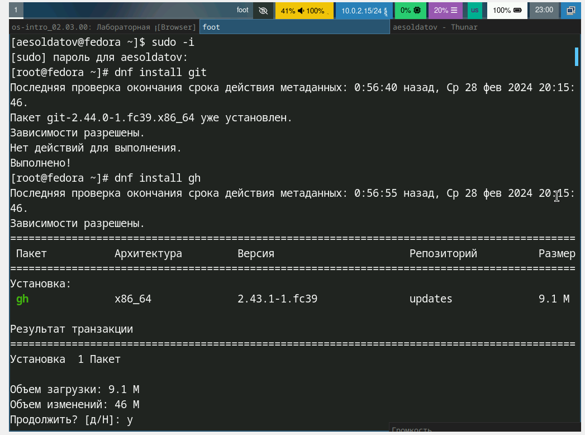{#fig:001 width=70%}

## Задал имя и email владельца репозитория. Настроил utf-8 в выводе сообщений git. Задал имя начальной ветки. Указал параметы "autocrlf" и "safecrlf".

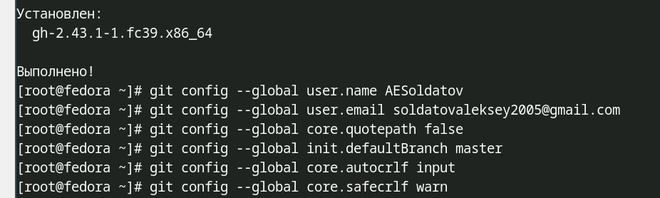{#fig:002 width=70%}

# Создать ключ SSH.

## По алгоритму rsa с ключём размером 4096 бит.

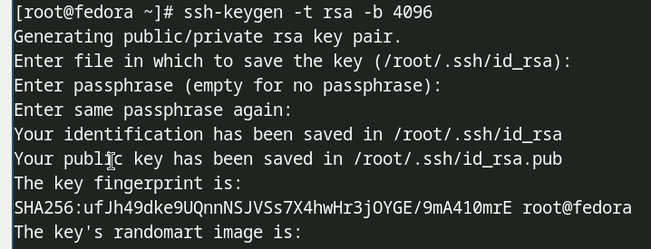{#fig:003 width=70%}

## По алгоритму ed25519.

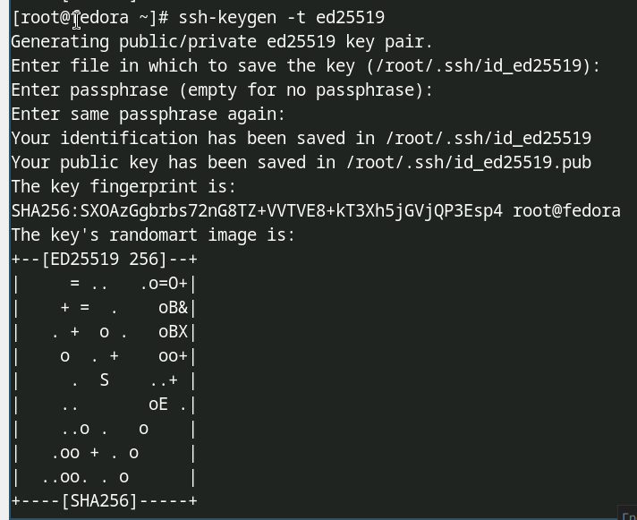{#fig:004 width=70%}

# Создать ключ PGP.

## Сгенерировал ключ и выбрал нужные опции.

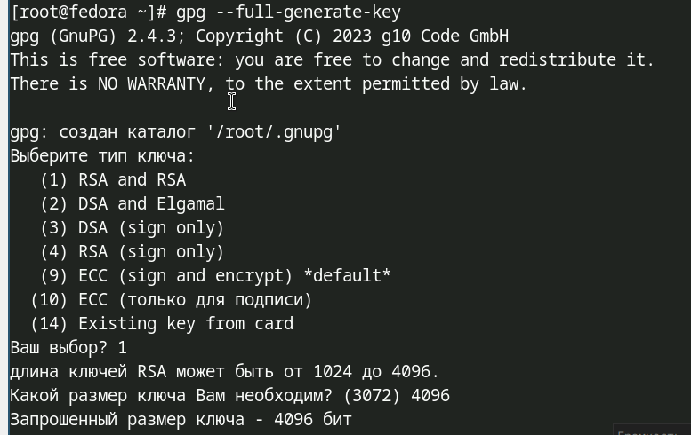{#fig:005 width=70%}

## Вывел список ключей и скопировал мой сгенерированный PGP ключ в буфер обмена.

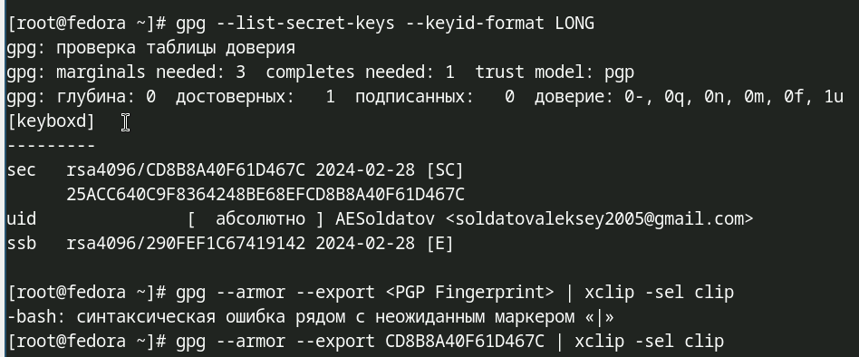{#fig:006 width=70%}

# Настроить подписи git, зарегистрироваться на Github.

## Настроил автоматические подписи коммитов git и авторизировался.

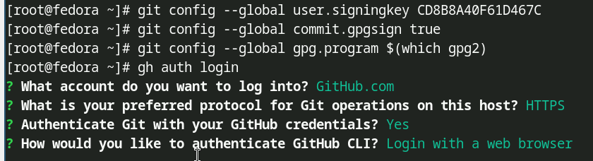{#fig:007 width=70%}

# Создать локальный каталог для выполнения заданий по предмету.

## Создал необходимый путь и перешел в папку "Операционные системы".

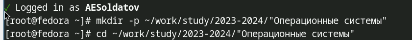{#fig:008 width=70%}

## Создал шаблон рабочего пространства.

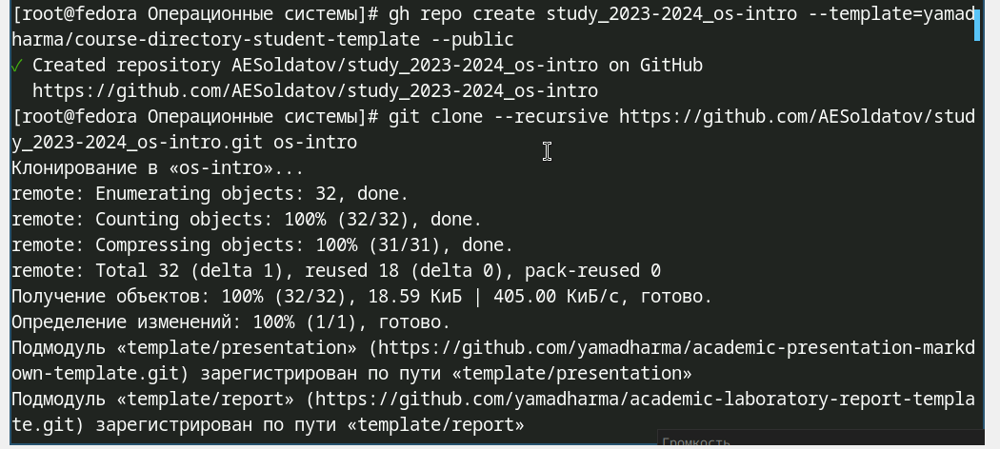{#fig:009 width=70%}

## Перешел в каталог курса, удалил лишние файлы, создал необходимые каталоги.

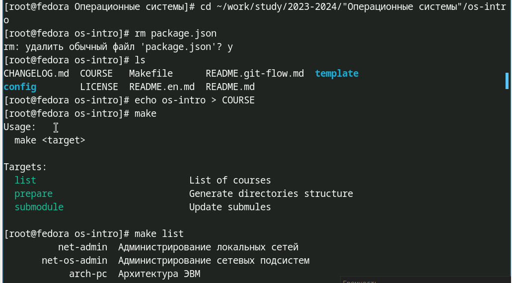{#fig:010 width=70%}

## Добавил и закоммитил файлы.

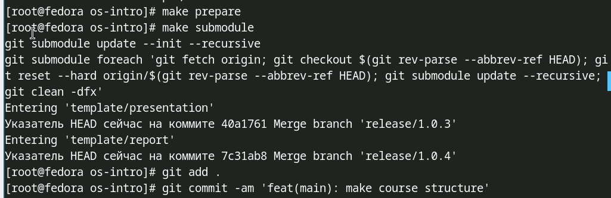{#fig:011 width=70%}

## Отправил файлы на сервер.

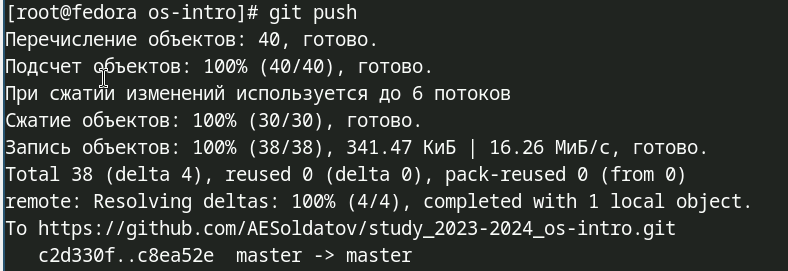{#fig:012 width=70%}

# Выводы

Изучил идеологию и применение средств контроля версий и освоил умения по работе с git.

# Список литературы{.unnumbered}

::: (https://esystem.rudn.ru/mod/page/view.php?id=1098790#orgf425532)
:::

