---
## Front matter
title: "Лабораторная работа №2"
subtitle: "Github"
author: "Солдатов Алексей"

## Generic otions
lang: ru-RU
toc-title: "Содержание"

## Bibliography
bibliography: bib/cite.bib
csl: pandoc/csl/gost-r-7-0-5-2008-numeric.csl

## Pdf output format
toc: true # Table of contents
toc-depth: 2
lof: true # List of figures
lot: true # List of tables
fontsize: 12pt
linestretch: 1.5
papersize: a4
documentclass: scrreprt
## I18n polyglossia
polyglossia-lang:
  name: russian
  options:
	- spelling=modern
	- babelshorthands=true
polyglossia-otherlangs:
  name: english
## I18n babel
babel-lang: russian
babel-otherlangs: english
## Fonts
mainfont: PT Serif
romanfont: PT Serif
sansfont: PT Sans
monofont: PT Mono
mainfontoptions: Ligatures=TeX
romanfontoptions: Ligatures=TeX
sansfontoptions: Ligatures=TeX,Scale=MatchLowercase
monofontoptions: Scale=MatchLowercase,Scale=0.9
## Biblatex
biblatex: true
biblio-style: "gost-numeric"
biblatexoptions:
  - parentracker=true
  - backend=biber
  - hyperref=auto
  - language=auto
  - autolang=other*
  - citestyle=gost-numeric
## Pandoc-crossref LaTeX customization
figureTitle: "Рис."
tableTitle: "Таблица"
listingTitle: "Листинг"
lofTitle: "Список иллюстраций"
lotTitle: "Список таблиц"
lolTitle: "Листинги"
## Misc options
indent: true
header-includes:
  - \usepackage{indentfirst}
  - \usepackage{float} # keep figures where there are in the text
  - \floatplacement{figure}{H} # keep figures where there are in the text
---

# Цель работы

## Изучить идеологию и применение средств контроля версий.
## Освоить умения по работе с git.

# Задание

1. Создать базовую конфигурацию для работы с git.
2. Создать ключ SSH.
3. Создать ключ PGP.
4. Настроить подписи git.
5. Зарегистрироваться на Github.
6. Создать локальный каталог для выполнения заданий по предмету.

# Теоретическое введение

Здесь описываются теоретические аспекты, связанные с выполнением работы.

Например, в табл. [-@tbl:std-dir] приведено краткое описание стандартных каталогов Unix.

: Описание некоторых каталогов файловой системы GNU Linux {#tbl:std-dir}

| Имя каталога | Описание каталога                                                                                                          |
|--------------|----------------------------------------------------------------------------------------------------------------------------|
| `/`          | Корневая директория, содержащая всю файловую                                                                               |
| `/bin `      | Основные системные утилиты, необходимые как в однопользовательском режиме, так и при обычной работе всем пользователям     |
| `/etc`       | Общесистемные конфигурационные файлы и файлы конфигурации установленных программ                                           |
| `/home`      | Содержит домашние директории пользователей, которые, в свою очередь, содержат персональные настройки и данные пользователя |
| `/media`     | Точки монтирования для сменных носителей                                                                                   |
| `/root`      | Домашняя директория пользователя  `root`                                                                                   |
| `/tmp`       | Временные файлы                                                                                                            |
| `/usr`       | Вторичная иерархия для данных пользователя                                                                                 |

Более подробно про Unix см. в [@tanenbaum_book_modern-os_ru; @robbins_book_bash_en; @zarrelli_book_mastering-bash_en; @newham_book_learning-bash_en].

# Выполнение лабораторной работы

Установил програмное обеспечение с помощью команд "dnf install git" и "dnf install gh" (рис. [-@fig:001]).

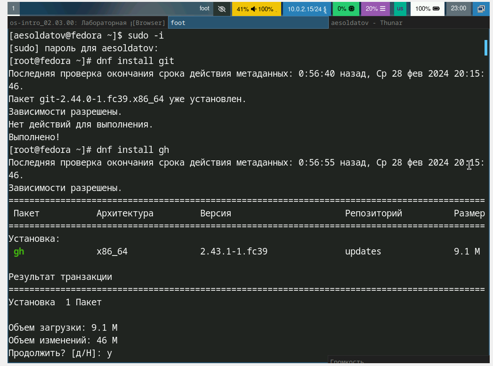{#fig:001 width=70%}

Осуществил базовую настройку git.
Задал имя и email владельца репозитория. Настроил utf-8 в выводе сообщений git. Задал имя начальной ветки. Указал параметы "autocrlf" и "safecrlf" (рис. [-@fig:02]).

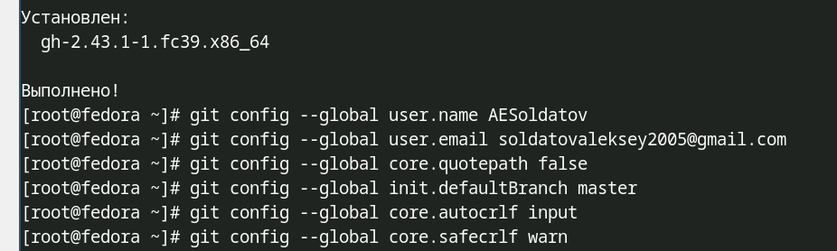{#fig:002 width=70%}

Создал ключи SSH.

По алгоритму rsa с ключём размером 4096 бит (рис. [-@fig:003]).

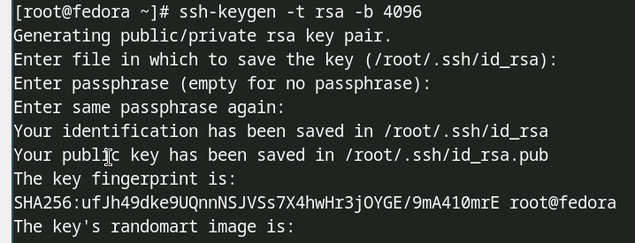{#fig:003 width=70%}

По алгоритму ed25519 (рис. [-@fig:004]).

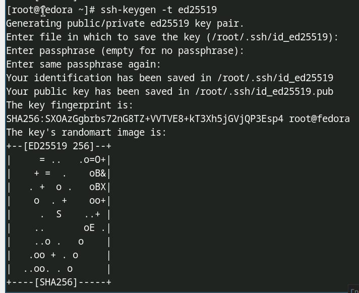{#fig:004 width=70%}

Создал ключ GPG

Сгенерировал ключ и выбрал нужные опции (рис. [-@fig:005]).

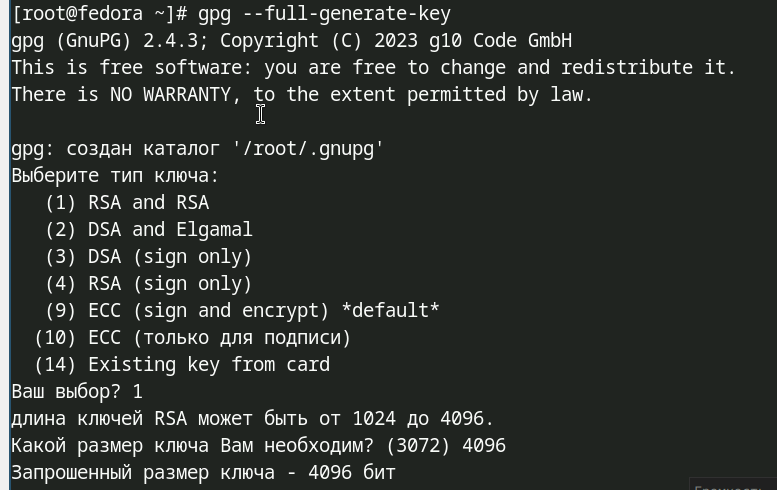{#fig:005 width=70%}

Вывел список ключей и скопировал мой сгенерированный PGP ключ в буфер обмена (рис. [-@fig:006]).

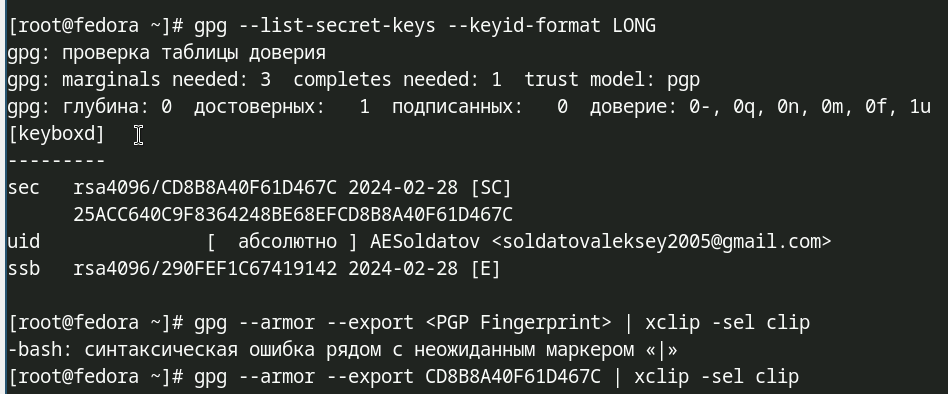{#fig:006 width=70%}

Настроил автоматические подписи коммитов git и авторизировался (рис. [-@fig:007]).

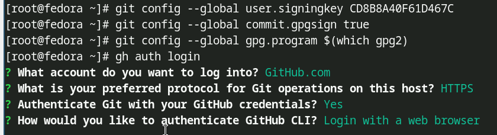{#fig:007 width=70%}

Создал необходимый путь и перешел в папку "Операционные системы" (рис. [-@fig:008]).

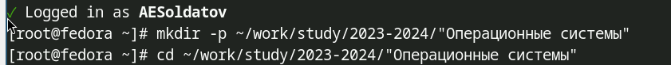{#fig:008 width=70%}

Создал шаблон рабочего пространства (рис. [-@fig:009]).

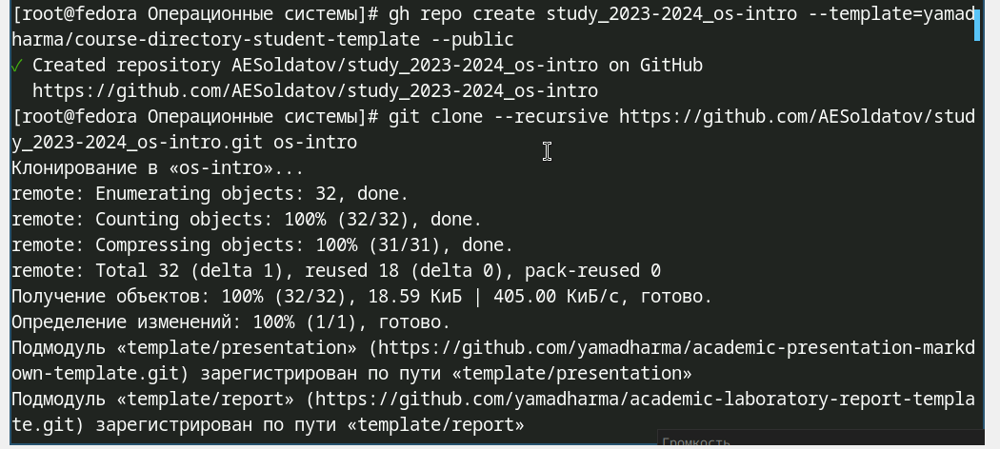{#fig:009 width=70%}

Перешел в каталог курса, удалил лишние файлы, создал необходимые каталоги (рис. [-@fig:010]).

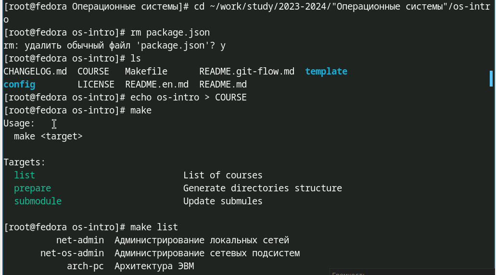{#fig:010 width=70%}

Добавил и закоммитил файлы (рис. [-@fig:011]).

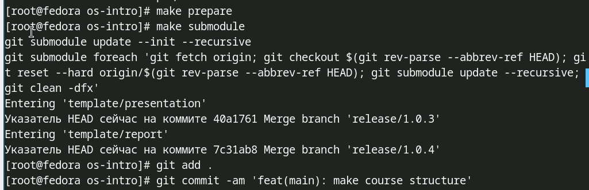{#fig:011 width=70%}

Отправил файлы на сервер (рис. [-@fig:012]).

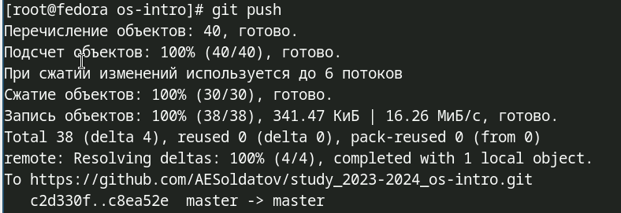{#fig:012 width=70%}

# Выводы

Изучил идеологию и применение средств контроля версий и освоил умения по работе с git.

# Список литературы{.unnumbered}

::: (https://esystem.rudn.ru/mod/page/view.php?id=1098790#orgf425532)
:::
