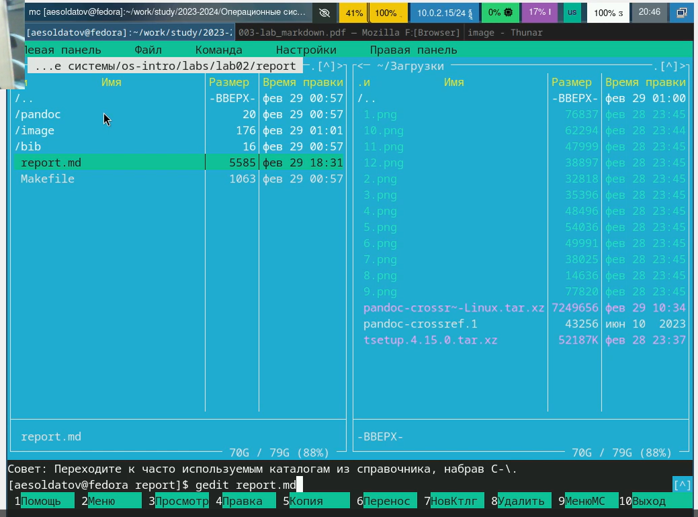
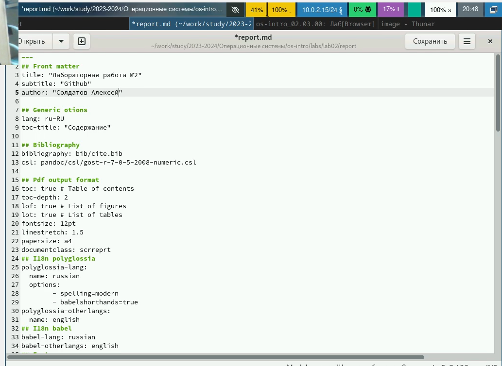
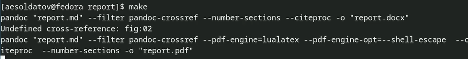
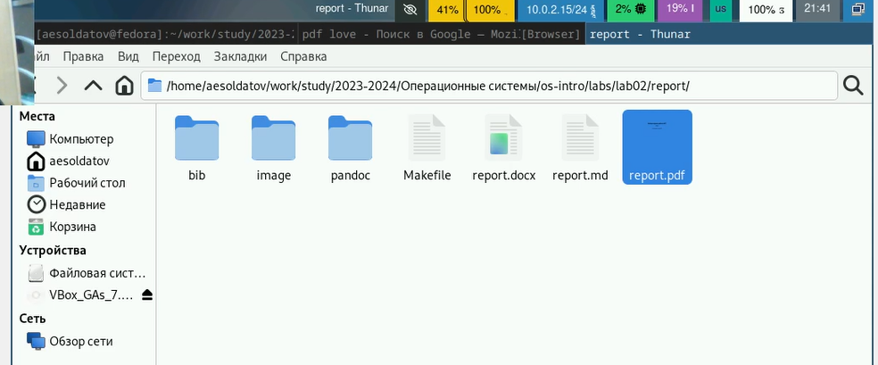

---
## Front matter
lang: ru-RU
title: Лабораторная работа №3
subtitle: Markdown
author:
  - Солдатов А. Е.
institute:
  - Российский университет дружбы народов, Москва, Россия

## i18n babel
babel-lang: russian
babel-otherlangs: english

## Formatting pdf
toc: false
toc-title: Содержание
slide_level: 2
aspectratio: 169
section-titles: true
theme: metropolis
header-includes:
 - \metroset{progressbar=frametitle,sectionpage=progressbar,numbering=fraction}
 - '\makeatletter'
 - '\beamer@ignorenonframefalse'
 - '\makeatother'
---

## Цель работы

Научиться оформлять отчёты с помощью легковесного языка разметки Markdown.

## Задание

1. Сделайте отчёт по предыдущей лабораторной работе в формате Markdown.
2. В качестве отчёта просьба предоставить отчёты в 3 форматах: pdf, docx и md.

# Теоретическое введение

Здесь описываются теоретические аспекты, связанные с выполнением работы.

Например, в табл. [-@tbl:std-dir] приведено краткое описание стандартных каталогов Unix.

: Описание некоторых каталогов файловой системы GNU Linux {#tbl:std-dir}

| Имя каталога | Описание каталога                                                                                                          |
|--------------|----------------------------------------------------------------------------------------------------------------------------|
| `/`          | Корневая директория, содержащая всю файловую                                                                               |
| `/bin `      | Основные системные утилиты, необходимые как в однопользовательском режиме, так и при обычной работе всем пользователям     |
| `/etc`       | Общесистемные конфигурационные файлы и файлы конфигурации установленных программ                                           |
| `/home`      | Содержит домашние директории пользователей, которые, в свою очередь, содержат персональные настройки и данные пользователя |
| `/media`     | Точки монтирования для сменных носителей                                                                                   |
| `/root`      | Домашняя директория пользователя  `root`                                                                                   |
| `/tmp`       | Временные файлы                                                                                                            |
| `/usr`       | Вторичная иерархия для данных пользователя                                                                                 |

Более подробно про Unix см. в [@tanenbaum_book_modern-os_ru; @robbins_book_bash_en; @zarrelli_book_mastering-bash_en; @newham_book_learning-bash_en].

# Выполнение лабораторной работы

# Сделать отчёт по предыдущей лабораторной работе в формате Markdown.

## Перешел в папку с отчетом по лабораторной работе 2 и открыл файл "report.md" с помощью gedit.

{#fig:001 width=70%}

## Внес данные в шаблон отчета.

{#fig:002 width=70%}

# В качестве отчёта предоставить отчёты в 3 форматах: pdf, docx и md.

## Скомпилировал отчет с помощью команды make.

{#fig:003 width=70%}

## Убедился, что все три файла создались.

{#fig:004 width=70%}

## Выводы

Научился оформлять отчёты с помощью легковесного языка разметки Markdown.

## Список литературы{.unnumbered}

::: {#refs}
:::

