---
## Front matter
lang: ru-RU
title: Лабораторная работа №4
subtitle: Продвинутое использование git
author:
  - Солдатов А. Е.
institute:
  - Российский университет дружбы народов, Москва, Россия

## i18n babel
babel-lang: russian
babel-otherlangs: english

## Formatting pdf
toc: false
toc-title: Содержание
slide_level: 2
aspectratio: 169
section-titles: true
theme: metropolis
header-includes:
 - \metroset{progressbar=frametitle,sectionpage=progressbar,numbering=fraction}
 - '\makeatletter'
 - '\beamer@ignorenonframefalse'
 - '\makeatother'
---

# Цель работы

Получение навыков правильной работы с репозиториями git.

# Задание

1. Выполнить работу для тестового репозитория.
2. Преобразовать рабочий репозиторий в репозиторий с git-flow и conventional commits.

# Теоретическое введение

Здесь описываются теоретические аспекты, связанные с выполнением работы.

Например, в табл. [-@tbl:std-dir] приведено краткое описание стандартных каталогов Unix.

: Описание некоторых каталогов файловой системы GNU Linux {#tbl:std-dir}

| Имя каталога | Описание каталога                                                                                                          |
|--------------|----------------------------------------------------------------------------------------------------------------------------|
| `/`          | Корневая директория, содержащая всю файловую                                                                               |
| `/bin `      | Основные системные утилиты, необходимые как в однопользовательском режиме, так и при обычной работе всем пользователям     |
| `/etc`       | Общесистемные конфигурационные файлы и файлы конфигурации установленных программ                                           |
| `/home`      | Содержит домашние директории пользователей, которые, в свою очередь, содержат персональные настройки и данные пользователя |
| `/media`     | Точки монтирования для сменных носителей                                                                                   |
| `/root`      | Домашняя директория пользователя  `root`                                                                                   |
| `/tmp`       | Временные файлы                                                                                                            |
| `/usr`       | Вторичная иерархия для данных пользователя                                                                                 |

Более подробно про Unix см. в [@tanenbaum_book_modern-os_ru; @robbins_book_bash_en; @zarrelli_book_mastering-bash_en; @newham_book_learning-bash_en].

# Выполнение лабораторной работы

# Выполнил работу для тестового репозитория.

## Прописал команды для установки из коллекции репозиториев Copr

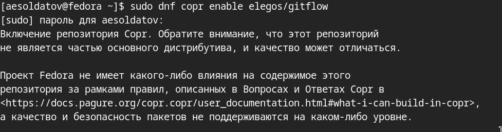{#fig:001 width=70%}

##

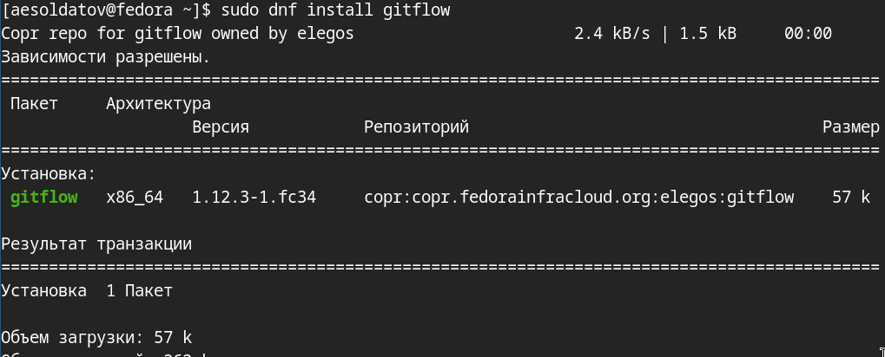{#fig:002 width=70%}

## Установил nodejs

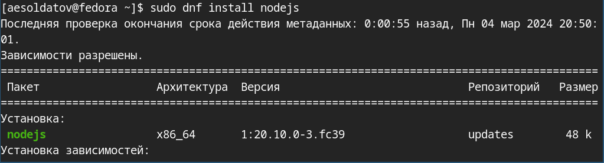{#fig:003 width=70%}

## Установил pnpm

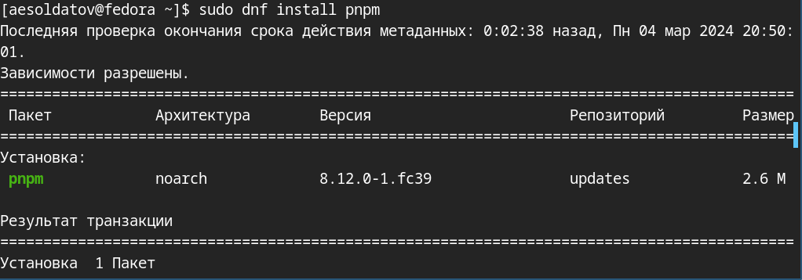{#fig:004 width=70%}

## Запустил pnpm и перелогинился

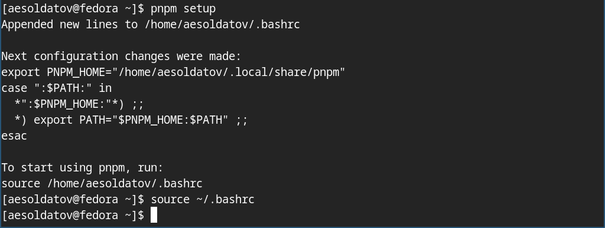{#fig:005 width=70%}

## Добавил программу для помощи в форматировании коммитов

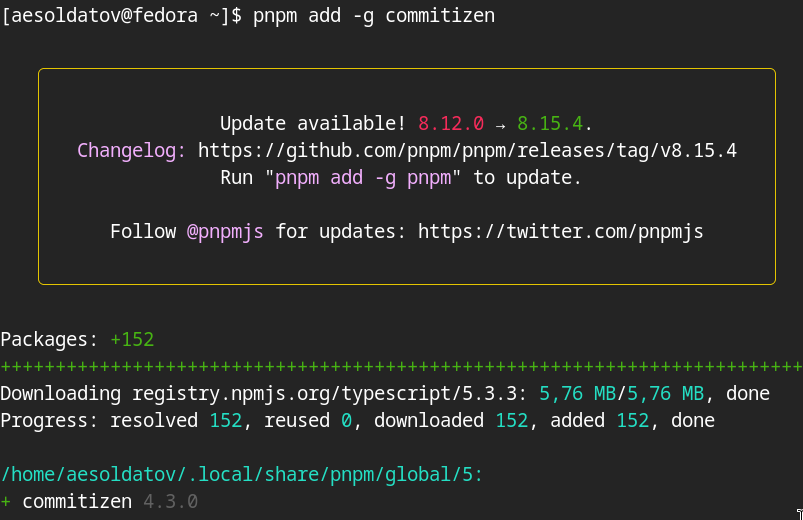{#fig:006 width=70%}

## Добавил программу для помощи в создании логов

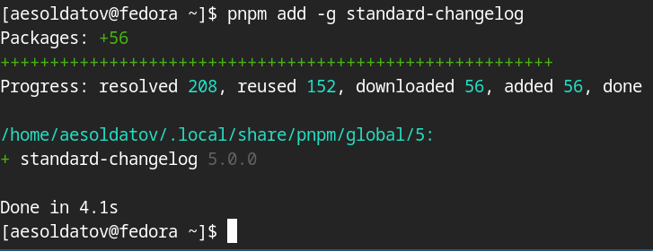{#fig:007 width=70%}

## Создал новый репозиторий "git-extended" и скопировал его адрес

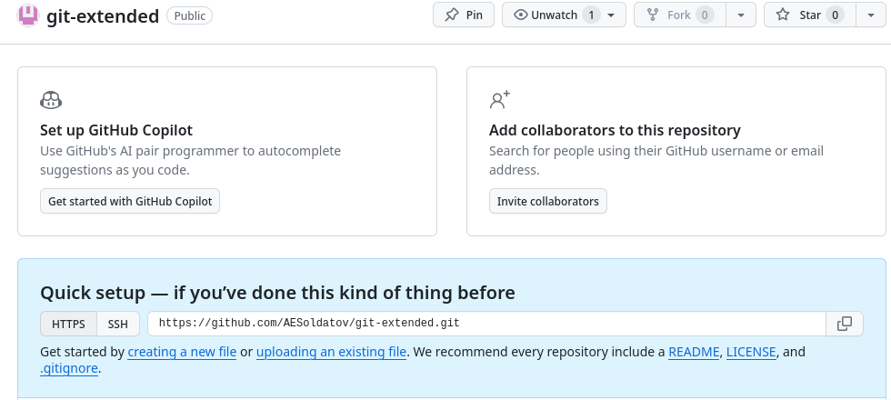{#fig:008 width=70%}

##Клонировал новый репозиторий на устройство и создал файл "README.md"

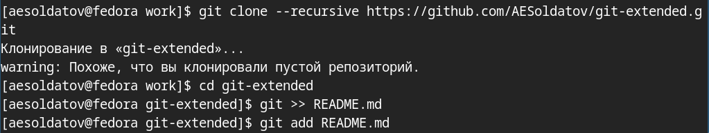{#fig:009 width=70%}

## Сделал первый коммит и выложил на github

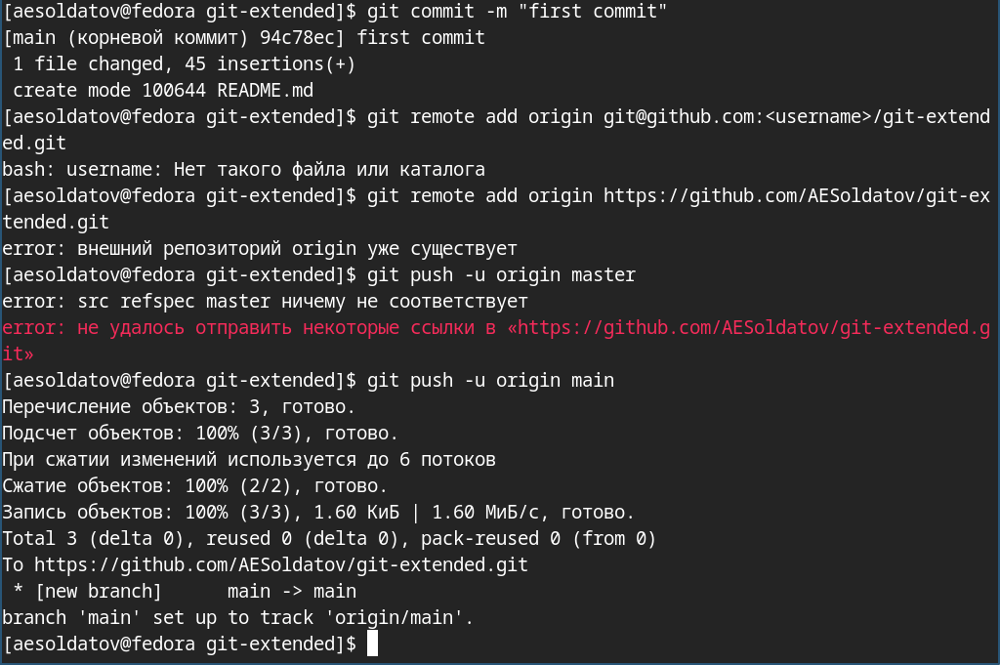{#fig:010 width=70%}

## Создал конфигурацию для пакетов Node.js

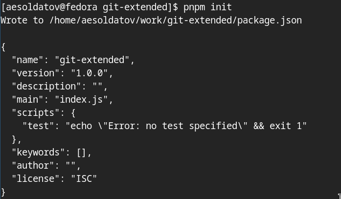{#fig:011 width=70%}

## Заполнил несколько параметров пакета по примеру из ТУИС

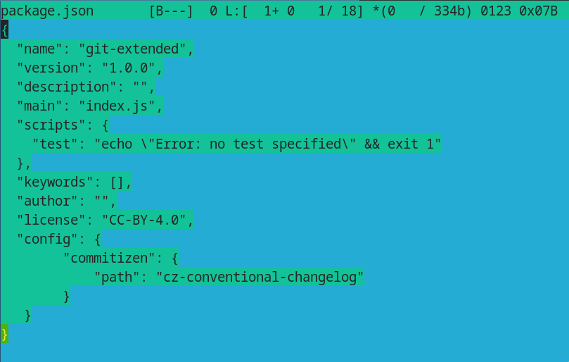{#fig:012 width=70%}

## Добавил новые файлы, сделал коммит и отправил на gitgub

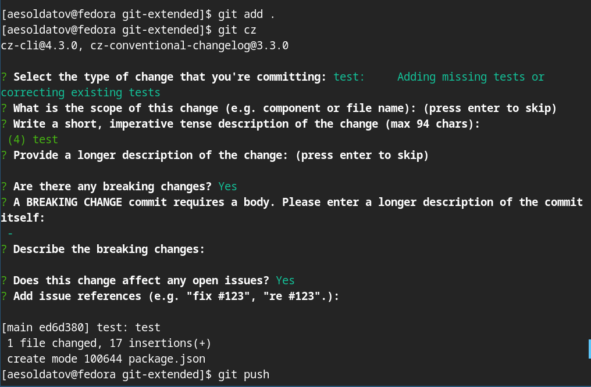{#fig:013 width=70%}

## Инициализировал git-flow, проверил, что я на ветке develop

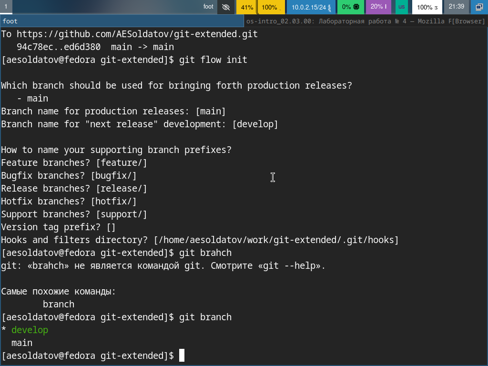{#fig:014 width=70%}

## Загрузил весь репозиторий в хранилище, установил внешнюю ветку как вышестоящую для этой ветки и создадим релиз с версией 1.0.0

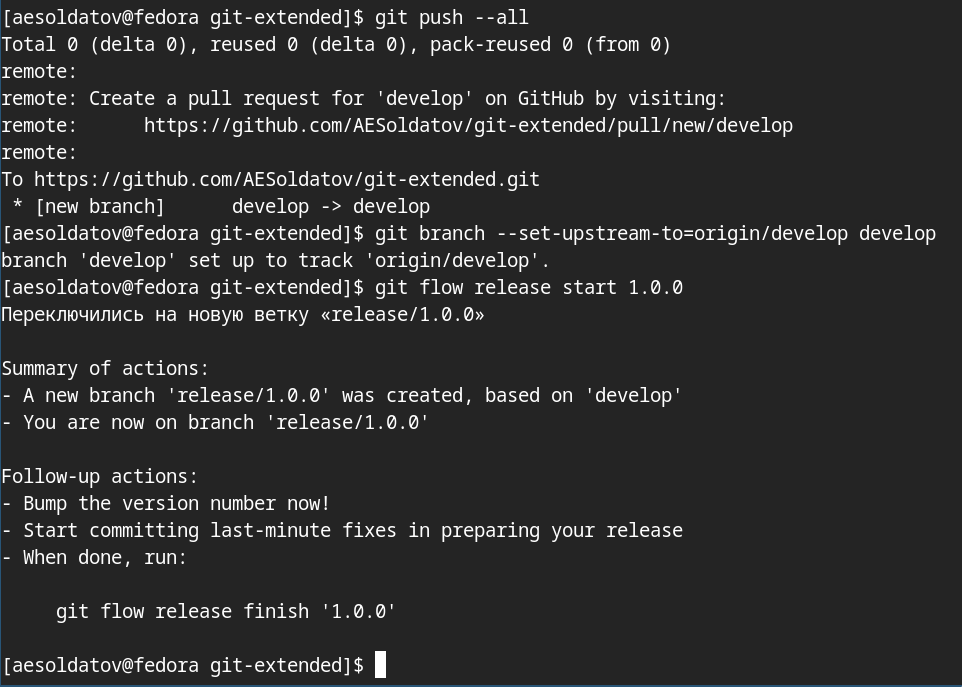{#fig:015 width=70%}

## Создал журнал изменений, добавил журнал изменений в индекс и залил релизную ветку в основную ветку

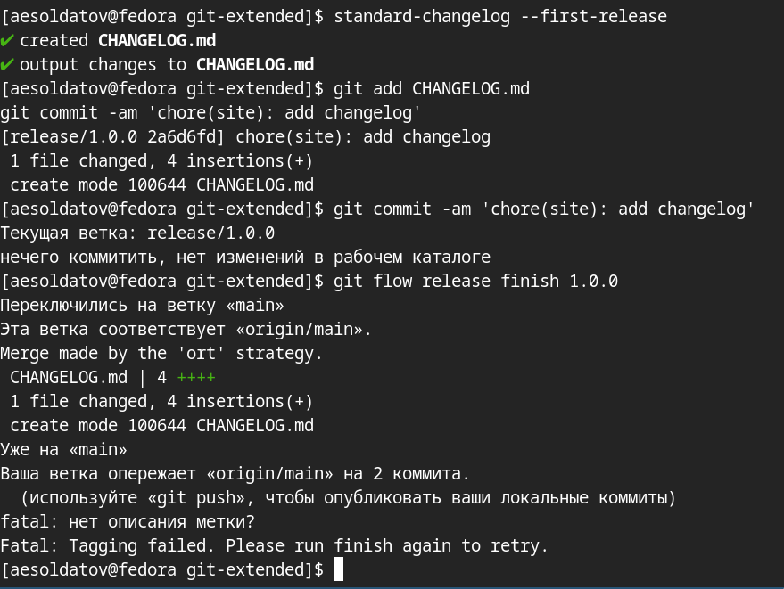{#fig:016 width=70%}

## Отправил данные на github и создал релиз на github

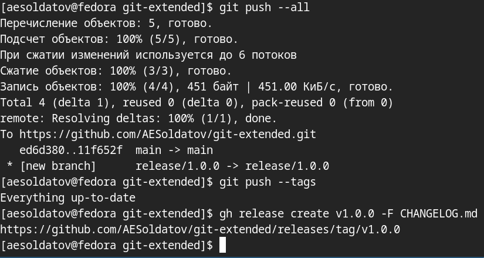{#fig:017 width=70%}

# Преобразовал рабочий репозиторий в репозиторий с git-flow и conventional commits.

## Создал ветку для новой функциональности и по окончании разработки новой функциональности объединил ветку

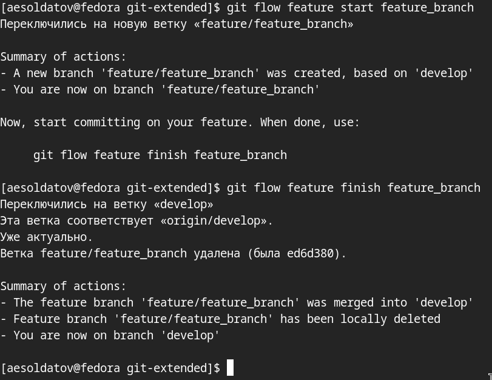{#fig:018 width=70%}

## Создал релиз с версией 1.2.3, создал журнал изменений и добавил журнал изменений в индекс

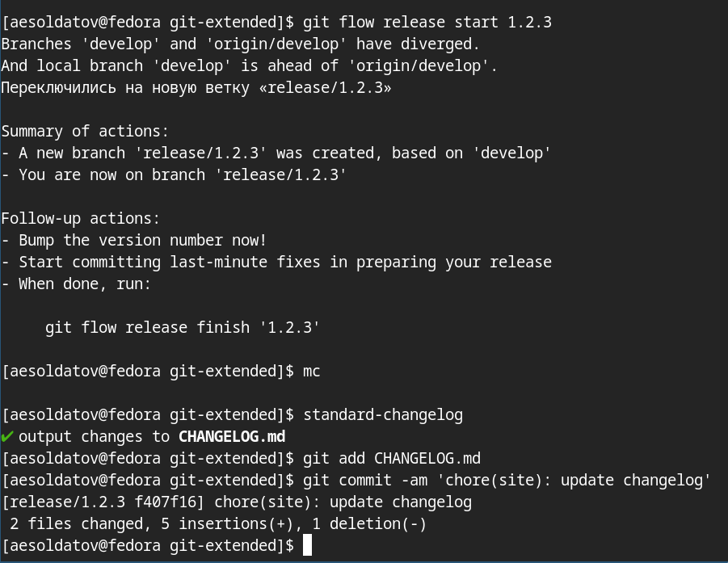{#fig:019 width=70%}

## Обновил номер версии в файле package.json. Установил её в 1.2.3

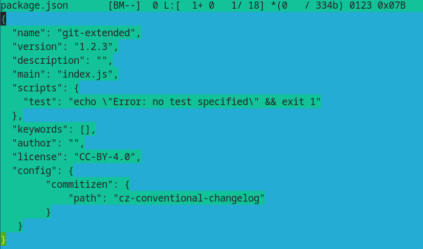{#fig:020 width=70%}

## Залил релизную ветку в основную ветку (рис. [-@fig:021]).

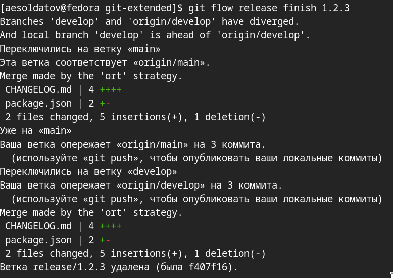{#fig:021 width=70%}

## Отправил данные на github и создал релиз на github с комментарием из журнала изменений

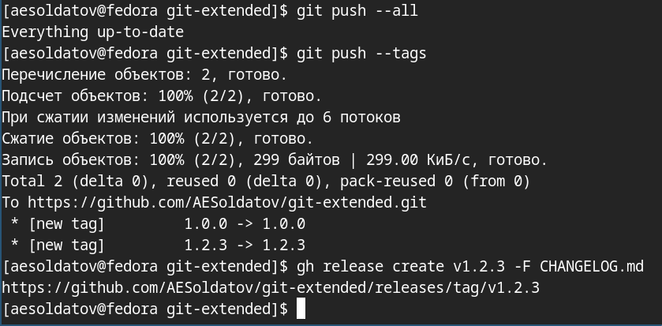{#fig:022 width=70%}

# Выводы

Получил навыки правильной работы с репозиториями git.
