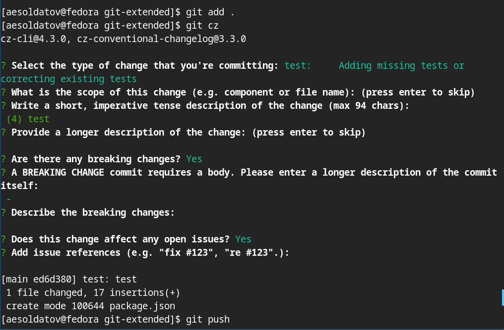

---
## Front matter
title: "Лабораторная работа №4"
subtitle: "Продвинутое использование git"
author: "Солдатов Алексей"

## Generic otions
lang: ru-RU
toc-title: "Содержание"

## Bibliography
bibliography: bib/cite.bib
csl: pandoc/csl/gost-r-7-0-5-2008-numeric.csl

## Pdf output format
toc: true # Table of contents
toc-depth: 2
lof: true # List of figures
lot: true # List of tables
fontsize: 12pt
linestretch: 1.5
papersize: a4
documentclass: scrreprt
## I18n polyglossia
polyglossia-lang:
  name: russian
  options:
	- spelling=modern
	- babelshorthands=true
polyglossia-otherlangs:
  name: english
## I18n babel
babel-lang: russian
babel-otherlangs: english
## Fonts
mainfont: PT Serif
romanfont: PT Serif
sansfont: PT Sans
monofont: PT Mono
mainfontoptions: Ligatures=TeX
romanfontoptions: Ligatures=TeX
sansfontoptions: Ligatures=TeX,Scale=MatchLowercase
monofontoptions: Scale=MatchLowercase,Scale=0.9
## Biblatex
biblatex: true
biblio-style: "gost-numeric"
biblatexoptions:
  - parentracker=true
  - backend=biber
  - hyperref=auto
  - language=auto
  - autolang=other*
  - citestyle=gost-numeric
## Pandoc-crossref LaTeX customization
figureTitle: "Рис."
tableTitle: "Таблица"
listingTitle: "Листинг"
lofTitle: "Список иллюстраций"
lotTitle: "Список таблиц"
lolTitle: "Листинги"
## Misc options
indent: true
header-includes:
  - \usepackage{indentfirst}
  - \usepackage{float} # keep figures where there are in the text
  - \floatplacement{figure}{H} # keep figures where there are in the text
---

# Цель работы

Получение навыков правильной работы с репозиториями git.

# Задание

1. Выполнить работу для тестового репозитория.
2. Преобразовать рабочий репозиторий в репозиторий с git-flow и conventional commits.

# Теоретическое введение

Здесь описываются теоретические аспекты, связанные с выполнением работы.

Например, в табл. [-@tbl:std-dir] приведено краткое описание стандартных каталогов Unix.

: Описание некоторых каталогов файловой системы GNU Linux {#tbl:std-dir}

| Имя каталога | Описание каталога                                                                                                          |
|--------------|----------------------------------------------------------------------------------------------------------------------------|
| `/`          | Корневая директория, содержащая всю файловую                                                                               |
| `/bin `      | Основные системные утилиты, необходимые как в однопользовательском режиме, так и при обычной работе всем пользователям     |
| `/etc`       | Общесистемные конфигурационные файлы и файлы конфигурации установленных программ                                           |
| `/home`      | Содержит домашние директории пользователей, которые, в свою очередь, содержат персональные настройки и данные пользователя |
| `/media`     | Точки монтирования для сменных носителей                                                                                   |
| `/root`      | Домашняя директория пользователя  `root`                                                                                   |
| `/tmp`       | Временные файлы                                                                                                            |
| `/usr`       | Вторичная иерархия для данных пользователя                                                                                 |

Более подробно про Unix см. в [@tanenbaum_book_modern-os_ru; @robbins_book_bash_en; @zarrelli_book_mastering-bash_en; @newham_book_learning-bash_en].

# Выполнение лабораторной работы

## Выполнил работу для тестового репозитория.

Прописал команды для установки из коллекции репозиториев Copr (рис. [-@fig:001], [-@fig:002]).

{#fig:001 width=70%}

{#fig:002 width=70%}

Установил nodejs (рис. [-@fig:003]).

{#fig:003 width=70%}

Установил pnpm (рис. [-@fig:004]).

{#fig:004 width=70%}

Запустил pnpm и перелогинился (рис. [-@fig:005]).

{#fig:005 width=70%}

Добавил программу для помощи в форматировании коммитов (рис. [-@fig:006]).

{#fig:006 width=70%}

Добавил программу для помощи в создании логов (рис. [-@fig:007]).

{#fig:007 width=70%}

Создал новый репозиторий "git-extended" и скопировал его адрес (рис. [-@fig:008]).

{#fig:008 width=70%}

Клонировал новый репозиторий на устройство и создал файл "README.md" (рис. [-@fig:009]).

{#fig:009 width=70%}

Сделал первый коммит и выложил на github (рис. [-@fig:010]).

{#fig:010 width=70%}

Создал конфигурацию для пакетов Node.js (рис. [-@fig:011]).

{#fig:011 width=70%}

Заполнил несколько параметров пакета по примеру из ТУИС (рис. [-@fig:012]).

{#fig:012 width=70%}

Добавил новые файлы, сделал коммит и отправил на gitgub (рис. [-@fig:013]).

{#fig:013 width=70%}

Инициализировал git-flow, проверил, что я на ветке develop (рис. [-@fig:014]).

{#fig:014 width=70%}

Загрузил весь репозиторий в хранилище, установил внешнюю ветку как вышестоящую для этой ветки и создадим релиз с версией 1.0.0 (рис. [-@fig:015]).

{#fig:015 width=70%}

Создал журнал изменений, добавил журнал изменений в индекс и залил релизную ветку в основную ветку (рис. [-@fig:016]).

{#fig:016 width=70%}

Отправил данные на github и создал релиз на github (рис. [-@fig:017]).

{#fig:017 width=70%}

## Преобразовал рабочий репозиторий в репозиторий с git-flow и conventional commits.

Создал ветку для новой функциональности и по окончании разработки новой функциональности объединил ветку (рис. [-@fig:018]).

{#fig:018 width=70%}

Создал релиз с версией 1.2.3, создал журнал изменений и добавил журнал изменений в индекс (рис. [-@fig:019]).

{#fig:019 width=70%}

Обновил номер версии в файле package.json. Установил её в 1.2.3 (рис. [-@fig:020]).

{#fig:020 width=70%}

Залил релизную ветку в основную ветку (рис. [-@fig:021]).

{#fig:021 width=70%}

Отправил данные на github и создал релиз на github с комментарием из журнала изменений (рис. [-@fig:022]).

{#fig:022 width=70%}

# Выводы

Получил навыки правильной работы с репозиториями git.

# Список литературы{.unnumbered}

::: {#refs}
:::
