---
## Front matter
lang: ru-RU
title: Лабораторная работа №5
subtitle: Настройка рабочей среды
author:
  - Солдатов А. Е.
institute:
  - Российский университет дружбы народов, Москва, Россия

## i18n babel
babel-lang: russian
babel-otherlangs: english

## Formatting pdf
toc: false
toc-title: Содержание
slide_level: 2
aspectratio: 169
section-titles: true
theme: metropolis
header-includes:
 - \metroset{progressbar=frametitle,sectionpage=progressbar,numbering=fraction}
 - '\makeatletter'
 - '\beamer@ignorenonframefalse'
 - '\makeatother'
---

# Цель работы

Настроить рабочую среду

# Задание

Настроить рабочую среду

# Теоретическое введение

Здесь описываются теоретические аспекты, связанные с выполнением работы.

Например, в табл. [-@tbl:std-dir] приведено краткое описание стандартных каталогов Unix.

: Описание некоторых каталогов файловой системы GNU Linux {#tbl:std-dir}

| Имя каталога | Описание каталога                                                                                                          |
|--------------|----------------------------------------------------------------------------------------------------------------------------|
| `/`          | Корневая директория, содержащая всю файловую                                                                               |
| `/bin `      | Основные системные утилиты, необходимые как в однопользовательском режиме, так и при обычной работе всем пользователям     |
| `/etc`       | Общесистемные конфигурационные файлы и файлы конфигурации установленных программ                                           |
| `/home`      | Содержит домашние директории пользователей, которые, в свою очередь, содержат персональные настройки и данные пользователя |
| `/media`     | Точки монтирования для сменных носителей                                                                                   |
| `/root`      | Домашняя директория пользователя  `root`                                                                                   |
| `/tmp`       | Временные файлы                                                                                                            |
| `/usr`       | Вторичная иерархия для данных пользователя                                                                                 |

Более подробно про Unix см. в [@tanenbaum_book_modern-os_ru; @robbins_book_bash_en; @zarrelli_book_mastering-bash_en; @newham_book_learning-bash_en].

# Выполнение лабораторной работы

## Установил/обновил пакеты pass и gopass (рис. [-@fig:001]).

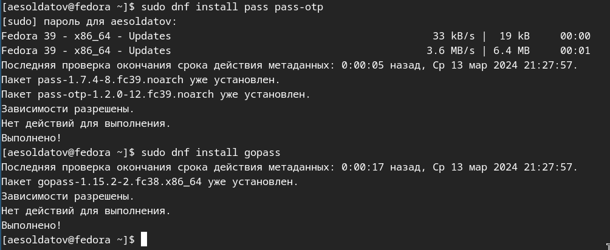{#fig:001 width=70%}

## Просмотрел списки ключей и создал новый (рис. [-@fig:002]).

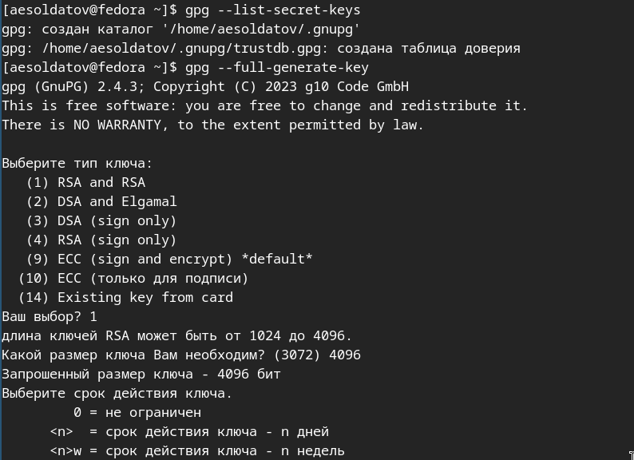{#fig:002 width=70%}

## Итоговые хар-ки ключа (рис. [-@fig:003]).

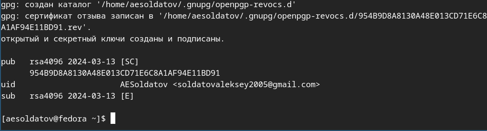{#fig:003 width=70%}

## Инициализировал хранилище, создал структуру git, задал адрес и синхронизировал (рис. [-@fig:004]).

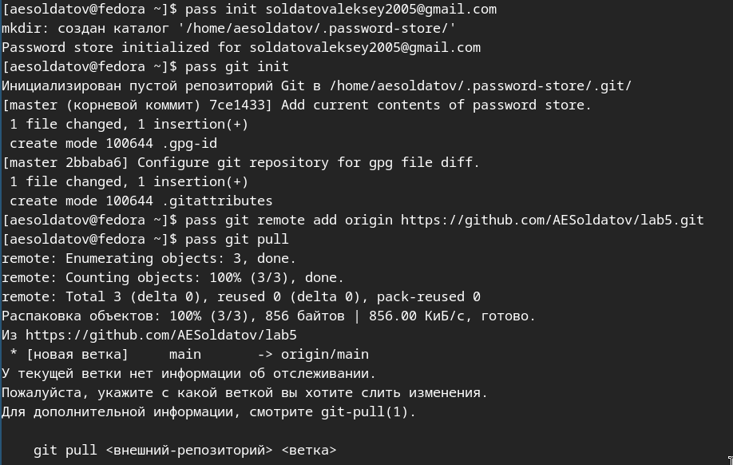{#fig:004 width=70%}

## Вручную закоммитил изменения и выложил их (рис. [-@fig:005]).

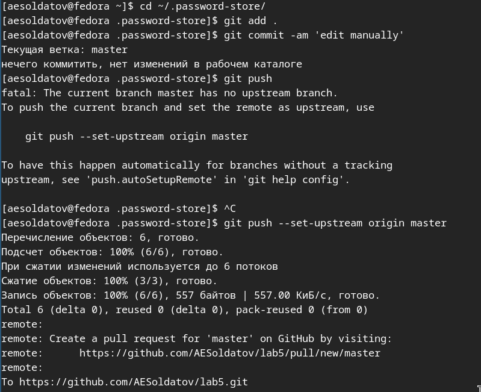{#fig:005 width=70%}

## Подключился и установил browserpass (рис. [-@fig:006]).

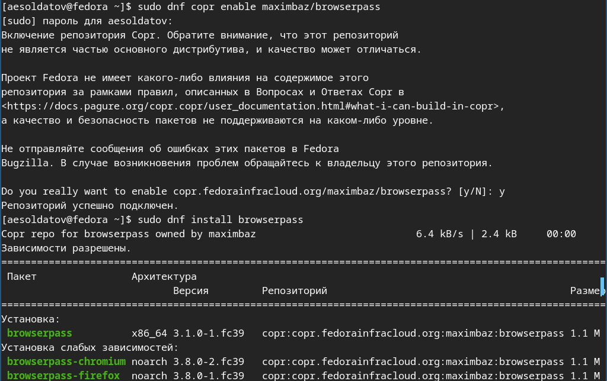{#fig:006 width=70%}

## Добавил, отобразил и заменил пароль (рис. [-@fig:007]).

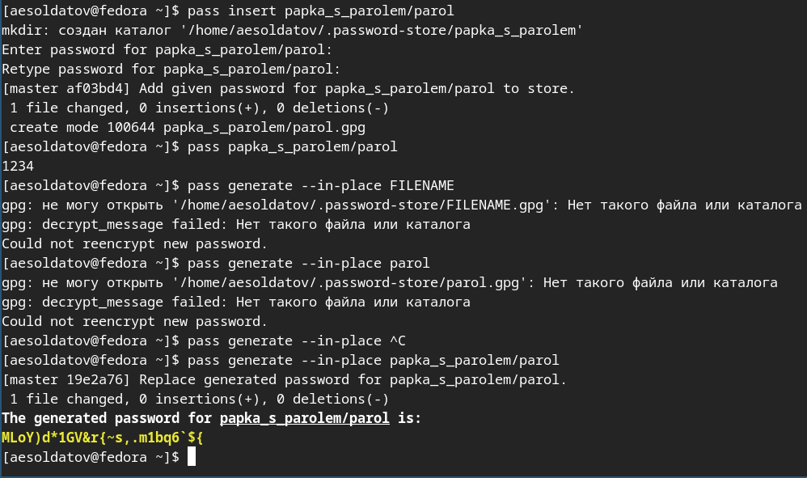{#fig:007 width=70%}

## Установил дополнительное программное обеспечение (рис. [-@fig:008]).

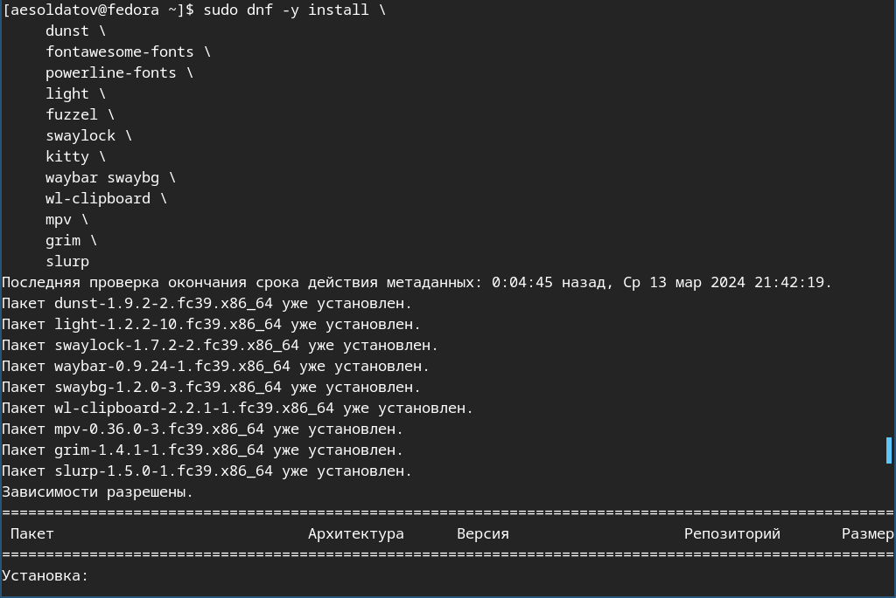{#fig:008 width=70%}

## Установил шрифты (рис. [-@fig:009]).

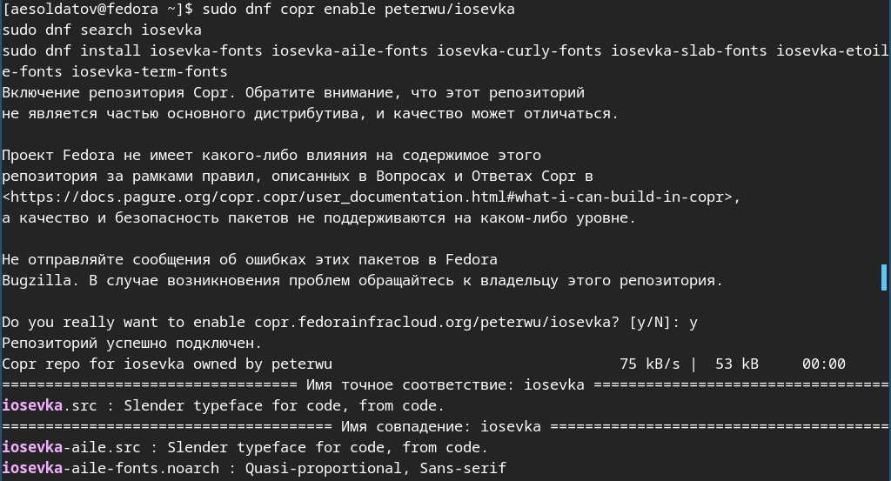{#fig:009 width=70%}

## Установил бинарный файл (рис. [-@fig:010]).

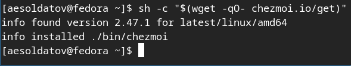{#fig:010 width=70%}

## Создадал свой репозиторий для конфигурационных файлов на основе шаблона, инициализировал chezmoi с оим репозиторием dotfiles и проверил, какие изменения внесёт chezmoi в домашний каталог (рис. [-@fig:011]).

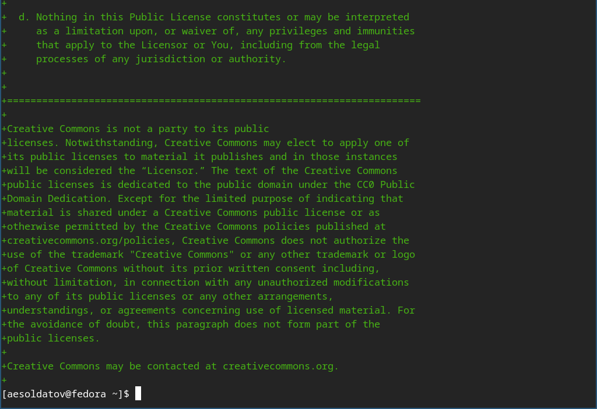{#fig:011 width=70%}

# Выводы

Настроил рабочую среду

