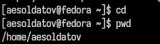
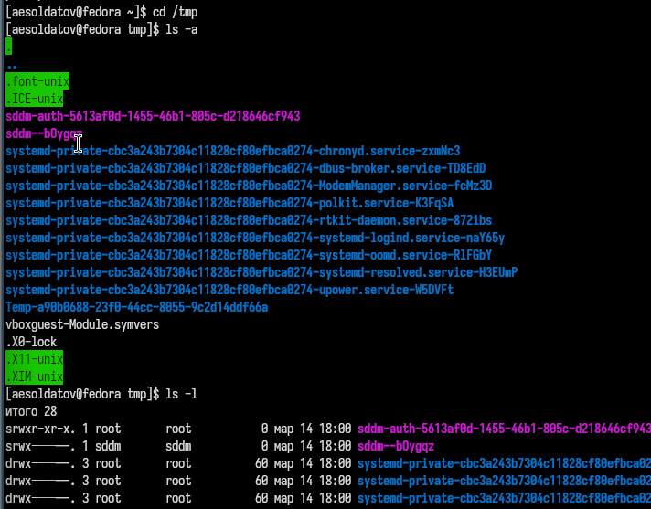
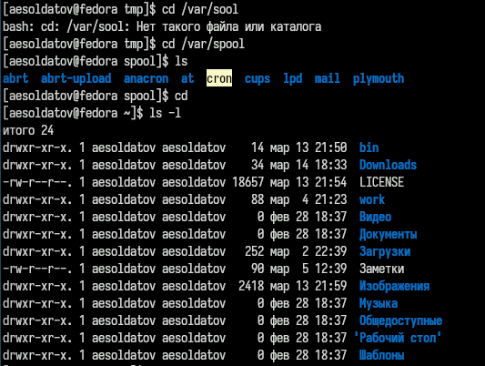
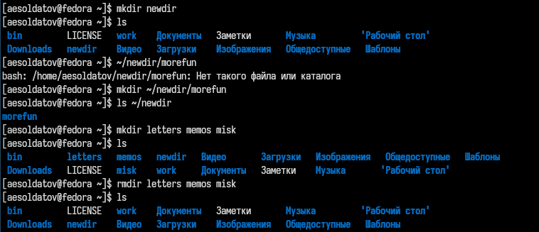
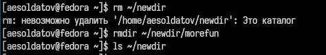
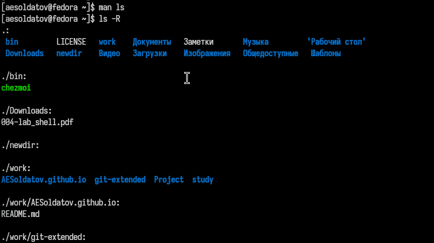
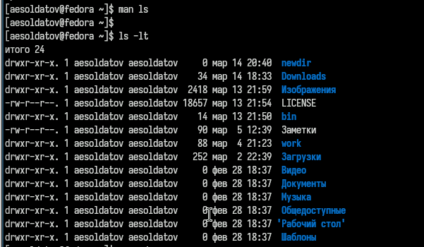
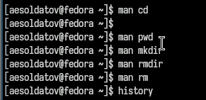
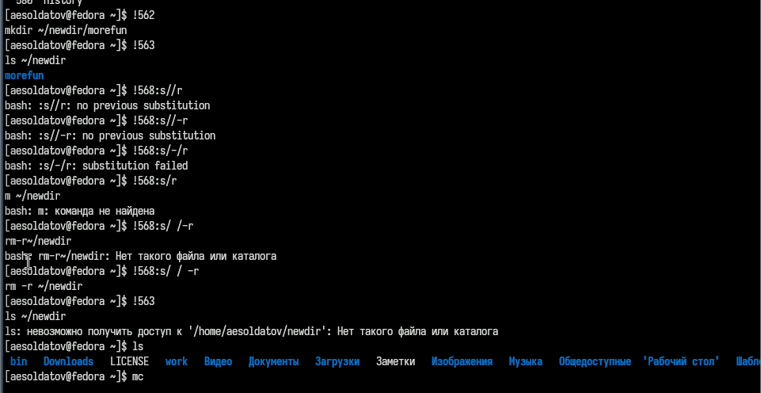

---
## Front matter
lang: ru-RU
title: Лабораторная работа №6
subtitle: Основы интерфейса взаимодействия пользователя с системой Unix на уровне командной строки
author:
  - Солдатов А. Е.
institute:
  - Российский университет дружбы народов, Москва, Россия

## i18n babel
babel-lang: russian
babel-otherlangs: english

## Formatting pdf
toc: false
toc-title: Содержание
slide_level: 2
aspectratio: 169
section-titles: true
theme: metropolis
header-includes:
 - \metroset{progressbar=frametitle,sectionpage=progressbar,numbering=fraction}
 - '\makeatletter'
 - '\beamer@ignorenonframefalse'
 - '\makeatother'
---

# Цель работы

Приобретение практических навыков взаимодействия пользователя с системой посредством командной строки.

# Задание

Выполнение определенных действий описанных в туис

# Теоретическое введение

Здесь описываются теоретические аспекты, связанные с выполнением работы.

Например, в табл. [-@tbl:std-dir] приведено краткое описание стандартных каталогов Unix.

: Описание некоторых каталогов файловой системы GNU Linux {#tbl:std-dir}

| Имя каталога | Описание каталога                                                                                                          |
|--------------|----------------------------------------------------------------------------------------------------------------------------|
| `/`          | Корневая директория, содержащая всю файловую                                                                               |
| `/bin `      | Основные системные утилиты, необходимые как в однопользовательском режиме, так и при обычной работе всем пользователям     |
| `/etc`       | Общесистемные конфигурационные файлы и файлы конфигурации установленных программ                                           |
| `/home`      | Содержит домашние директории пользователей, которые, в свою очередь, содержат персональные настройки и данные пользователя |
| `/media`     | Точки монтирования для сменных носителей                                                                                   |
| `/root`      | Домашняя директория пользователя  `root`                                                                                   |
| `/tmp`       | Временные файлы                                                                                                            |
| `/usr`       | Вторичная иерархия для данных пользователя                                                                                 |

Более подробно про Unix см. в [@tanenbaum_book_modern-os_ru; @robbins_book_bash_en; @zarrelli_book_mastering-bash_en; @newham_book_learning-bash_en].

# Выполнение лабораторной работы

## Определите полное имя вашего домашнего каталога (рис. [-@fig:001]).

{#fig:001 width=70%}

## Перейдите в каталог /tmp и вывел его содержимое командой ls с различными опциями (рис. [-@fig:002]).

{#fig:002 width=70%}

## Определил, есть ли в каталоге /var/spool подкаталог с именем cron, пото перешел в домашний каталог и вывел на экран его содержимое, далее определил, кто является владельцем файлов и подкаталогов (рис. [-@fig:003]).

{#fig:003 width=70%}

## В домашнем каталоге создал новый каталог с именем newdir далее в этом каталоге создал новый каталог с именем morefun. Потом в домашнем каталоге создал одной командой три новых каталога с именами letters, memos, misk. Затем удалил эти каталоги одной командой (рис. [-@fig:004]).

{#fig:004 width=70%}

## Попробовал удалить ранее созданный каталог ~/newdir командой rm, проверил, был ли каталог удалён (нет). Удалил каталог ~/newdir/morefun из домашнего каталога. Проверил, был ли каталог удалён (да) (рис. [-@fig:005]).

{#fig:005 width=70%}

## С помощью команды man определил, какую опцию команды ls нужно использовать для просмотра содержимого не только указанного каталога, но и подкаталогов, входящих в него (рис. [-@fig:006]).

{#fig:006 width=70%}

## С помощью команды man определил набор опций команды ls, позволяющий отсортировать по времени последнего изменения выводимый список содержимого каталога с развёрнутым описанием файлов (рис. [-@fig:007]).

{#fig:007 width=70%}

## Использовал команду man для просмотра описания следующих команд: cd, pwd, mkdir, rmdir, rm. Пояснил основные опции этих команд (рис. [-@fig:008]).

{#fig:008 width=70%}

## Используя информацию, полученную при помощи команды history, выполнил модификацию и исполнение нескольких команд из буфера команд (рис. [-@fig:009]).

{#fig:009 width=70%}

# Выводы

Приобрел практические навыки взаимодействия пользователя с системой посредством командной строки.

:::

