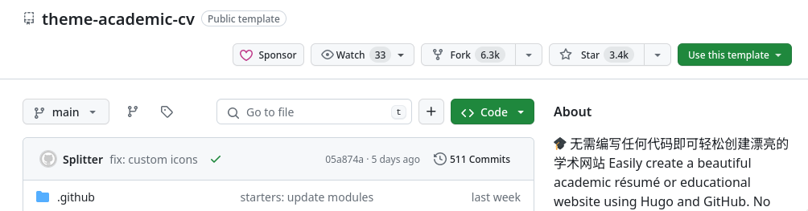

---
## Front matter
lang: ru-RU
title: Индивидуальный проект
subtitle: Часть 1
author:
  - Солдатов А. Е.
institute:
  - Российский университет дружбы народов, Москва, Россия

## i18n babel
babel-lang: russian
babel-otherlangs: english

## Formatting pdf
toc: false
toc-title: Содержание
slide_level: 2
aspectratio: 169
section-titles: true
theme: metropolis
header-includes:
 - \metroset{progressbar=frametitle,sectionpage=progressbar,numbering=fraction}
 - '\makeatletter'
 - '\beamer@ignorenonframefalse'
 - '\makeatother'
---

## Актуальность

Сайт с портфолио нужен для дальнейшего продвижения в научной сфере

# Выполнение проекта

## Скачал необходимый архив с сайта (рис. [-@fig:001]).

{#fig:001 width=70%}

## Перешел в папку "Загрузки", распаковал архив, проверил наличие файла и перенес его в папку "usr/local/bin" (рис. [-@fig:002]).

{#fig:002 width=70%}

## Перешел в репозиторий по ссылке в туис и сделал его копию (назвал Project) (рис. [-@fig:003]).

{#fig:003 width=70%}

## Копировал его ссылку (рис. [-@fig:004]).

{#fig:004 width=70%}

## Создал клон репозитория на устройстве (рис. [-@fig:005]).

{#fig:005 width=70%}

## Запустил сервер (рис. [-@fig:006]).

{#fig:006 width=70%}

## Копировал адрес сервера и вставил в адресную строку браузера, чтоб проверить правильность действий (рис. [-@fig:007]).

{#fig:007 width=70%}

## Создал новый репозиторий (рис. [-@fig:008]).

{#fig:008 width=70%}

## Клонировал новый репозиторий и перешел в него (рис. [-@fig:009]).

{#fig:009 width=70%}

## В этом каталоге я создал главную ветку, создал файл "README.md" и закоммитил (рис. [-@fig:010]).

{#fig:010 width=70%}

## Отправляю все по главной ветке (рис. [-@fig:011]).

{#fig:011 width=70%}

## Перехожу в папку проекта и ввожу команду, чтоб соединить репозитории (рис. [-@fig:012]).

{#fig:012 width=70%}

## В появившейся папке "public" редактирую файл ".gitignore" (рис. [-@fig:013]).

{#fig:013 width=70%}

## После редактирования снова ввожу команду, чтоб синхронизировать репозитории (рис. [-@fig:014]).

{#fig:014 width=70%}

## Пишу команду "hugo" (рис. [-@fig:015]).

{#fig:015 width=70%}

## Перехожу в "puclic" и прописываю команды (рис. [-@fig:016]).

{#fig:016 width=70%}

## Отправляю в гитхаб (рис. [-@fig:017]).

{#fig:017 width=70%}

## Проверяю правильность действий (рис. [-@fig:018]).

{#fig:018 width=70%}

## Выводы

Выполнил первый этап индивидуального проекта

# Список литературы{.unnumbered}

::: {#refs}
:::
