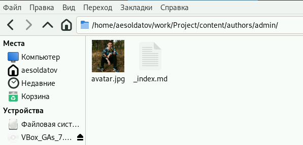
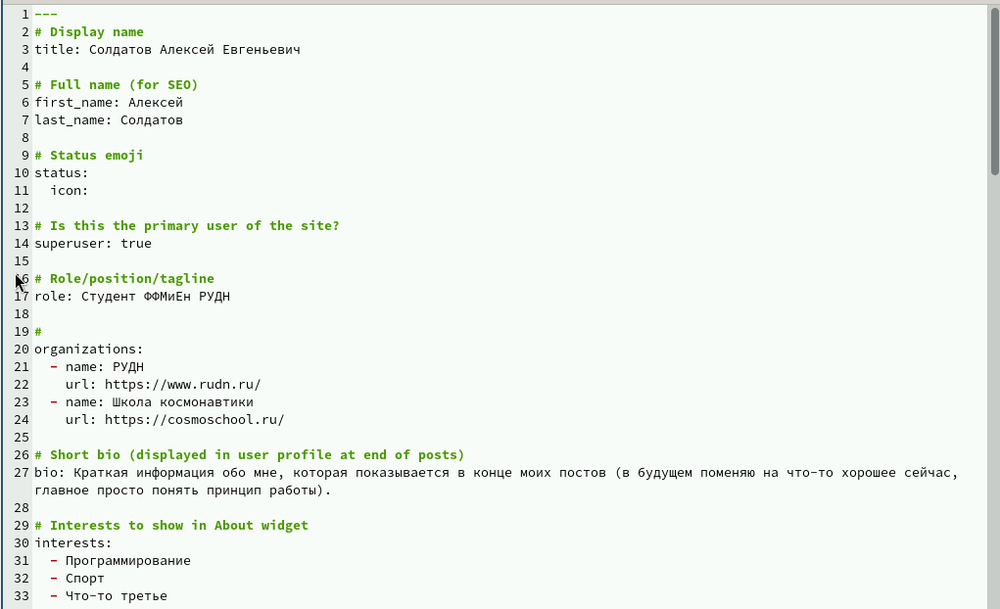
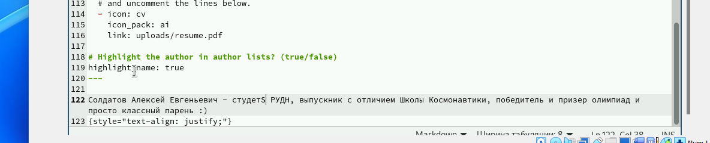
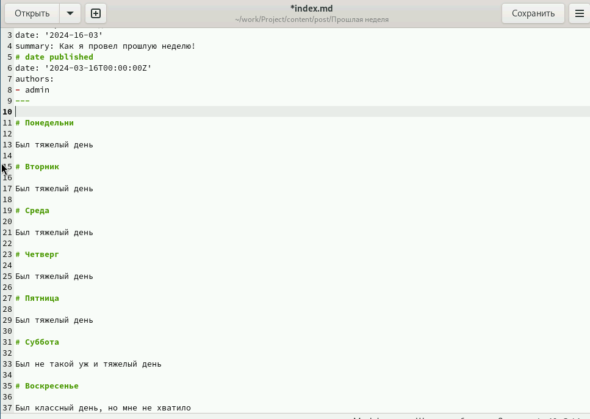
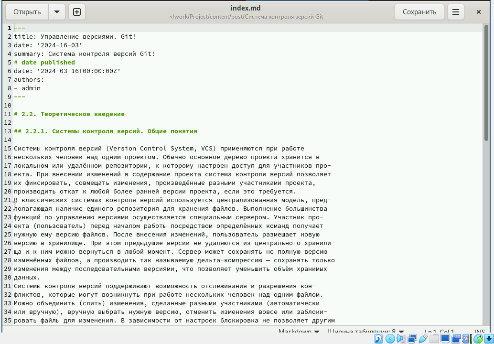
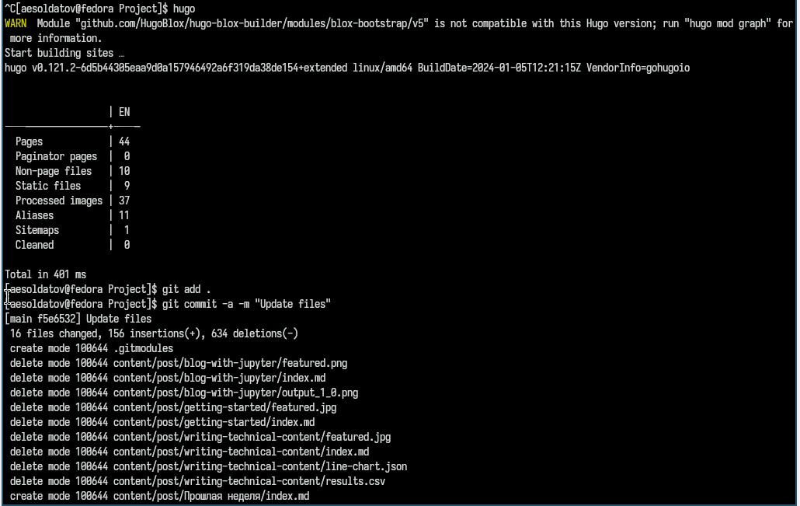
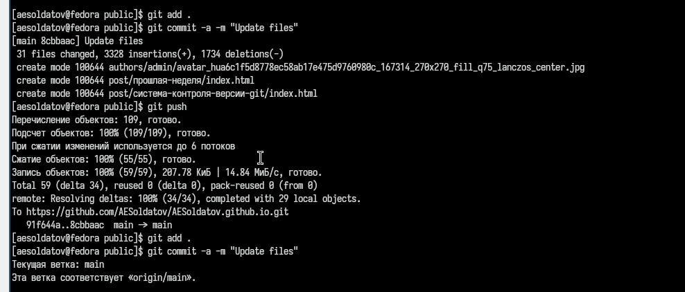
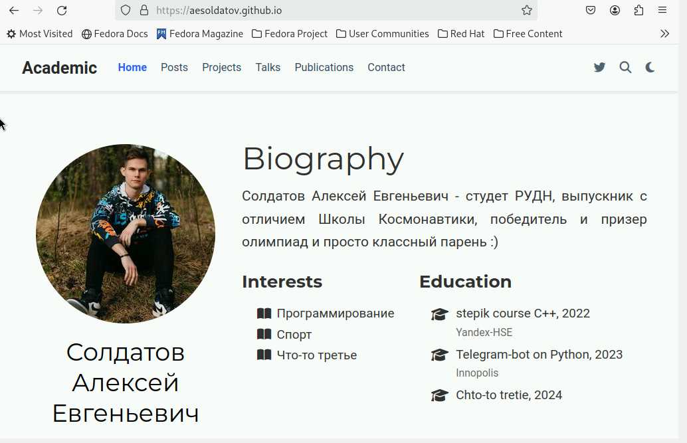

---
## Front matter
lang: ru-RU
title: Индивидуальный проект
subtitle: Часть 2
author:
  - Солдатов А. Е.
institute:
  - Российский университет дружбы народов, Москва, Россия

## i18n babel
babel-lang: russian
babel-otherlangs: english

## Formatting pdf
toc: false
toc-title: Содержание
slide_level: 2
aspectratio: 169
section-titles: true
theme: metropolis
header-includes:
 - \metroset{progressbar=frametitle,sectionpage=progressbar,numbering=fraction}
 - '\makeatletter'
 - '\beamer@ignorenonframefalse'
 - '\makeatother'
---

# Актуальность

Сайт с портфолио нужен для дальнейшего продвижения в научной сфере

# Выполнение проекта

## Запускаю hugo server через терминал (рис. [-@fig:001]).

{#fig:001 width=70%}

## Перехожу в папку "~/work/Project/content/authors/admin" и обновляю аватар (рис. [-@fig:002]).

{#fig:002 width=70%}

## В файле "_index.md" расписываю информацию о себе (рис. [-@fig:003], [-@fig:004]).

{#fig:003 width=70%}

##

{#fig:004 width=70%}

## Перехожу в папку "~/work/Project/content/post" и добавляю два поста по заданию из туис (рис. [-@fig:005]).

{#fig:005 width=70%}

## Прописываю первый пост (Как прошла неделя) (рис. [-@fig:006]).

{#fig:006 width=70%}

## Прописываю второй пост (Управление версиями git) (рис. [-@fig:007]).

{#fig:007 width=70%}

## Прописываю команду hugo в терминале, добавляю, коммичу и отправляю файлы из папки проекта (рис. [-@fig:008]).

{#fig:008 width=70%}

## Добавляю, коммичу и отправляю файлы из папки public (рис. [-@fig:009]).

{#fig:009 width=70%}

## Проверяю на правильность выполнения (рис. [-@fig:010]).

{#fig:010 width=70%}

# Выводы

Выполнил второй этап индивидуального проекта# Актуальность

:::

